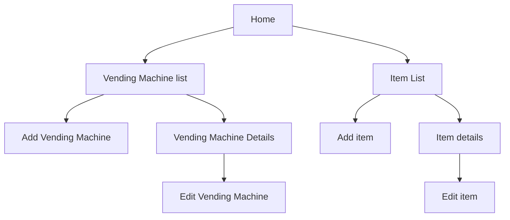

<h1 align="center">Vending Machine Tracker</h1>

## Project Summary: 
An ASP.NET web app that lets you track the pricing and availability of products from vending machines

This site allows the user to input in items into the system to track the price of at many different vending machines.

Here is a list of general features
- Add and modify vending machine info
- Add and modify item info
- View information about what vending machines have what items
- View information about what items each vending machine has

## Site Map:

### Page summary:
| Page Name | Purpose |
| - | - |
| Home | Provides General stats about vending machines in the system such as vending machine count, item count, latest updates, etc |
| Vending Machine List | Provides a list of vending machines with edit buttons on each row |
| Add Vending Machine | Lets you add a new vending machine |
| Vending Machine Details | Provides information about the vending machine as well as list of items, and controlls to add or remove those items and set pricing |
| Edit Vending Machine | Lets you modify vending machine properties as well as delete the machine |
| Item list | A list of the items avalible to assign to vending machines in the system. (e.g. "Oreos", or "Lay's Chips", not "Oreos in vending machine a") |
| Add item | Lets you input a new item |
| Item Details | Lets you see a list of the machines that have that item as well as item information |
| Edit item | Lets you modify item details | 

## Contribution Guidelines:
- When working, use a seperate branch from master then create a pull request to put the code in.
- Before merging your code into master, ensure the CI-CD checks pass first.
- Try to avoid branching off of other branches other than master unless the feature relies on the code from the other branch
